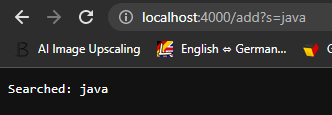
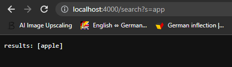
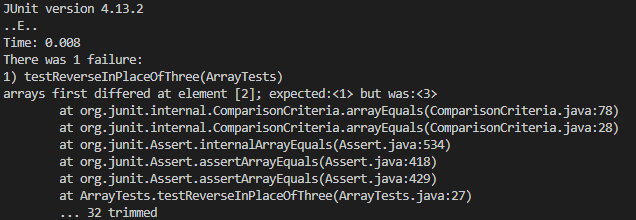
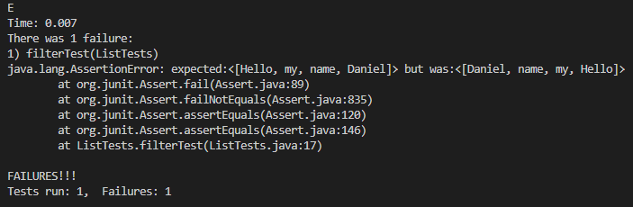

# Week 3 Lab Report

## Part 1 - SearchEngine
- Adding keywords to a list of Strings 

    

    - Here I added the keyword "apple" to the list of Strings.
    - Methods called: URI.getPath(), String.contains(), URI.getQuery(), String.split(), String.equals(), ArrayList.add(), String.format();
        - URI.getPath() takes in no argument, and returns a String displaying the path of a URL. In our case, it returns "/add?s=apple".
        - String.contains() takes in a String argument, which is utilized to see whether or not the String object in which it is called contains the specified argument String. In our case, it returns true. 
        - URI.getQuery() takes in no argument, and returns the query in the format of a String object. In our case, it returns "s=apple".
        - String.split() takes in a String argument, which is utilized to split apart the String object it is called upon and return a String array of multiple String objects. In our case, it returns ["s", "apple"].
        - String.equals() takes in a String argument, and compares if the object the method is called on is equal in value. In our case, it returns true, as parameters[0] is "s", and "s".equals("s").
        - ArrayList.add() takes in a generic Object argument, which is then added onto the ArrayList. It updates our qarray to contain the value "apple".
        - String.format() takes in Object type arguments, which then gets formatted in a String object to be returned. It prints out to the website "Searched: apple".

    

    - Here I added the keyword "java" to the list of Strings.
    - Methods called: URI.getPath(), String.contains(), URI.getQuery(), String.split(), String.equals(), ArrayList.add(), String.format();
         - URI.getPath() takes in no argument, and returns a String displaying the path of a URL. In our case, it returns "/add?s=java".
        - String.contains() takes in a String argument, which is utilized to see whether or not the String object in which it is called contains the specified argument String. In our case, it returns true. 
        - URI.getQuery() takes in no argument, and returns the query in the format of a String object. In our case, it returns "s=java".
        - String.split() takes in a String argument, which is utilized to split apart the String object it is called upon and return a String array of multiple String objects. In our case, it returns ["s", "java"].
        - String.equals() takes in a String argument, and compares if the object the method is called on is equal in value. In our case, it returns true, as parameters[0] is "s", and "s".equals("s").
        - ArrayList.add() takes in a generic Object argument, which is then added onto the ArrayList. It updates our qarray to contain the value "java".
        - String.format() takes in Object type arguments, which then gets formatted in a String object to be returned. It prints out to the website "Searched: java".
- Searching a keyword

    

    - Here I searched using the keyword "app," returning the result of "apple," as only "apple" contains "app."
    - Methods called: URI.getPath(), String.contains(), String.split(), String.equals(), ArrayList.size(), ArrayList.get(i), String.contains(), ArrayList.add(), String.format()
         - URI.getPath() takes in no argument, and returns a String displaying the path of a URL. In our case, it returns "/search?s=app".
        - String.contains() takes in a String argument, which is utilized to see whether or not the String object in which it is called contains the specified argument String. In our case, it returns true. 
        - String.split() takes in a String argument, which is utilized to split apart the String object it is called upon and return a String array of multiple String objects. In our case, it returns ["s", "app"].
        - String.equals() takes in a String argument, and compares if the object the method is called on is equal in value. In our case, it returns true, as parameters[0] is "s", and "s".equals("s").
        - ArrayList.size() returns the total number of generic specified Objects in the ArrayList. This value updates every time a new "/add" request is generated. 
        - ArrayList.get() returns the generic specified Object at the index, which is provided by an argument. This value updates every time a new "/add" request is generated. 
        - String.contains() returns a boolean value depending on whether or not the String object on which it is called has the specified String object argument. This value changes accordingly, based on whether or not the contents of qarray contains the specified String object argument. 
        - ArrayList.add() takes in a generic Object argument, which is then added onto the ArrayList. It updates our results to contain the value "apple", for "apple" contains "app."
        - String.format() takes in Object type arguments, which then gets formatted in a String object to be returned. In our case, it takes in "results" and the results ArrayList as arguments. It prints out to the website "Results: [apple]".

## SearchEngine implementation
```
class BooBasher implements URLHandler {
    ArrayList<String> qarray = new ArrayList<String>();
    public String handleRequest(URI url) {
        ArrayList<String> results = new ArrayList<String>();
        if(url.getPath().contains("/add")){
            String[] parameters = url.getQuery().split("=");
            if (parameters[0].equals("s")) {
                qarray.add(parameters[1]);
                return String.format("Searched: "+ parameters[1]);
            }
            return String.format("Searched items: " + qarray);
        }else if(url.getPath().contains("/search")){
            String[] parameters = url.getQuery().split("=");
            if (parameters[0].equals("s")) {
                for(int i = 0; i < qarray.size(); i++) {   
                    if(qarray.get(i).contains(parameters[1])){
                        results.add(qarray.get(i));
                    }
                }
            }
            return String.format("Results: ", results);
        }
        return "404 not found";
    }
}
```

## Part 2 - Bugs 
- In ArrayExamples.java, the method reverseInPlace fails to accomplish its intended goal of reversing the array. 
    - Failure inducing input: 
        ``` 
        @Test
        public void testReverseInPlaceOfThree(){
            int [] input1 = {1,2,3};
            ArrayExamples.reverseInPlace(input1);
            assertArrayEquals(new int[]{3,2,1}, input1);
        }
        ```
    - Symptom
    
        
    - The bug
        ```
        static void reverseInPlace(int[] arr) {
            for(int i = 0; i < arr.length; i += 1) {
                arr[i] = arr[arr.length - i - 1];
            }
        }
        ```
    - Connection between symptom and bug
        - ReverseInPlace modifies the same array passed in as an argument to reverse, meaning that it has no reference to what the array originally looked like. Therefore 3 at index 2 remains 3, for while it does recognize that it should copy the value from index 0, the value at index 0 was obtained from the value at index 2.  

- In ListExamples.java, the method filter fails to accomplish what it intended goal of returning Strings in the same order as they appear in the list argument.
    - Failure inducing input:
        ```

        @Test 
	    public void filterTest() {
            int[] input1 = { 3 };
            ArrayList<String> input = new ArrayList<String>();
            input.add("Hello");
            input.add("my");
            input.add("name");
            input.add("Daniel");
            StringChecker sc = new StringImp();
            assertEquals(input, ListExamples.filter(input, sc));
	    }
        ```
    - Symptom

        
    
    - The bug
        ```
        static List<String> filter(List<String> list, StringChecker sc) {
            List<String> result = new ArrayList<>();
            for(String s: list) {
                if(sc.checkString(s)) {
                    result.add(0, s);
                }
            }
        return result;
        }
        ```
    - Connection between symptom and bug
        - filter has an incorrect call of the ArrayList.add method, where the overloaded version of add, which essentially acts as insert, is called instead of the regular add method, which simply just adds a String object to the end of the ArrayList. The contents of the list, should they pass a certain internal set of checks, would print out the valid String objects in reverse order relative to how they were passed in as argument. This is because result.add(0,s) is called, and not result.add(s). 