# Week 1 Lab Report

## Installing VSCode
---
- To install VSCode, simply head over to the link https://code.visualstudio.com/ and follow the instructions labeled there. 
- When you have installed VSCode, the screen should appear similar to something like this: 
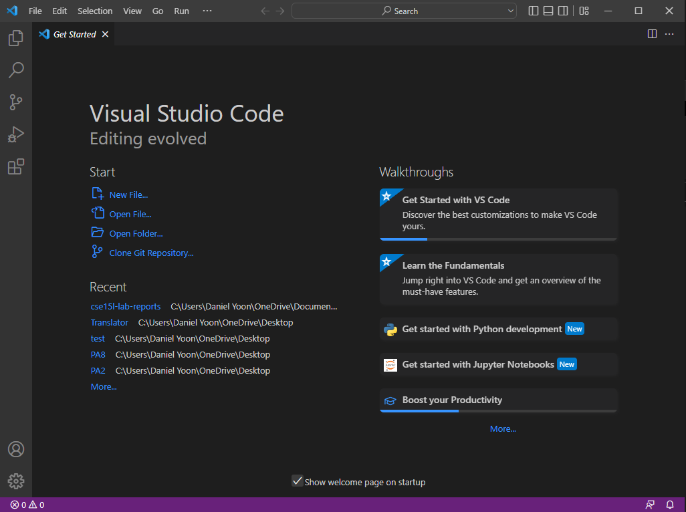
- To prepare for the next step, click on File > New File. 

## 

## Remotely Connecting
---
- [If you are on windows, ensure you follow the directions here to install the SSH client.](https://docs.microsoft.com/en-us/windows-server/administration/openssh/openssh_install_firstuse)
- Before attempting a connection to the remote server, ensure that your CS15L password is reset and ready for use. It may take several attempts before the password is accepted by the SSH. 
- On the top left corner, click on Terminal. 

    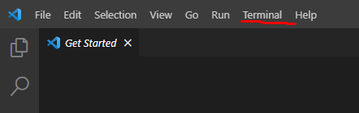

- In the new terminal, type in the following command: `ssh cs15lfa22**@ieng6.ucsd.edu` with the ** representing your unique two-letters for your username. 
- When first connecting to the remote server, you will see an authenticity warning in the terminal. This is expected behavior, as this is the first time you will be connecting to the machine. Type 'yes' and press enter to proceed. 

    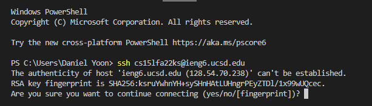
- Once you enter 'yes', you will be prompted to input your password. Your password can be reset at https://sdacs.ucsd.edu/~icc/index.php. 

    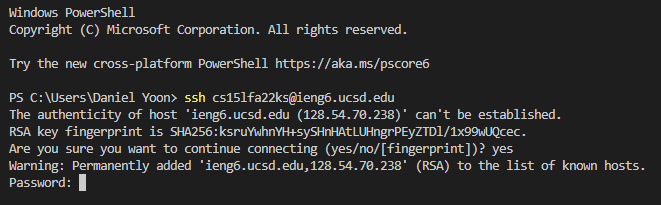
- Notice that the password will not show any characters as you type it in. This is expected behavior in order to ensure security. 
- Once you input your password in correctly, you will be logged into the remote server. You will see an output in the terminal similar to the following: 

    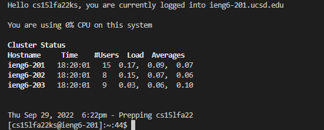
## Trying Some Commands
---
- The terminal has a list of basic commands that while you may not be familiar with its names, you are familiar with its functionalities through its counterparts in a graphical user interface. 
- "cs15lfa22ks" is the home directory of the author of this lab report, and mentions to the directory will be made throughout in order to provide information about the functionality of the commands. 

- Some of the following commands in every day use include: 
    - cd: **C**hanges **d**irectory to specified directory.

        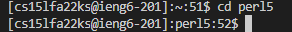 

        - I am changing my directory from "cs15lfa22ks" to "perl5". 

    - ls: **L**ist **short** provides a short list of the files and other directories in the current directory. 

        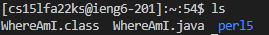

        - I am printing out the contents of the directory "cs15lfa22ks". 

    - pwd: **P**rint **w**orking **d**irectory outputs the current directory starting from the "home" directory.

        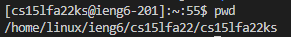

        - I am printing out the parent directories of the current directory "cs15lfa22ks"

    - cp: **C**o**p**ies specified files into the specified target directory.

        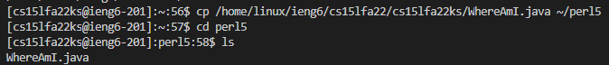

        - I have copied an existing file, "WhereAmI.java" from the directory "cs15lfa22ks" into another directory "perl5".

    - cat: Con**cat**enates the text in the specified file to the terminal. 

        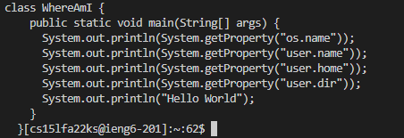

        - I have concatenated the text of the file "WhereAmI.java" located in the directory "cs15lfa22ks" into the terminal. As you can see, it is written in Java. 

    - mkdir: **M**a**k**es **dir**ectories of the specified name.

       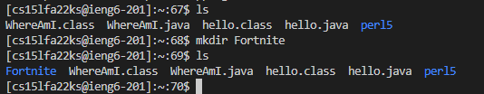

       - I have made a new directory named "Fortnite" in the home directory "cs15lfa22ks". 

## Moving Files with `scp`
---
- It is possible to move files from your local machine onto the remote machine using the command `scp`
    - `scp` stands for secure copy. 
- Identify the file you will be transferring from your local machine onto the remote machine. For our example, we will be using the file "hello.java". 

    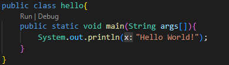

    - "hello.java" is located on the local machine, and does not exist in any form on the remote machine (as of yet).
- Into your terminal, type in the following command: `scp file.name cs15lfa22**ieng6.ucsd.edu:~/` with your specified file (replacing file.name) and your unique two-letters (replacing **).
    - Following the colon is the directory in which you will be placing your file. In our case, we will be putting it into the home directory (This is different from the "home" directory, whereas that is a name and the home directory we are discussing is the location we first access when logging onto the remote machine). 
- After inputting the command, input your password. If done successfully, you will see something pop up in the terminal similar to the following. 

    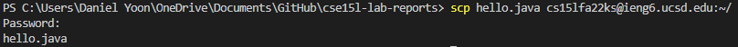
- Log into the remote server and ensure that your file is there. 

    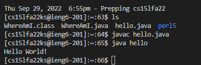

## Setting an SSH Key
---
- A time-saving alternative to inputting your password in every time you log into the remote server is the Secure Shell key.
- Secure shell keys allow you to log into the remote machine without being prompted with a password. 
- To create an ssh key, ensure that you are logged out of your remote machine and you are currently on your local machine. 
- Input the command `ssh-keygen`.
- You will be prompted to enter the directory where the key will be saved. Input the provided directory by the command. 

    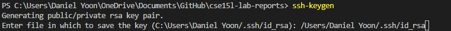

- You will be prompted to enter a passphrase. You may do so if you wish, but for the purpose of this tutorial the author will not. 

    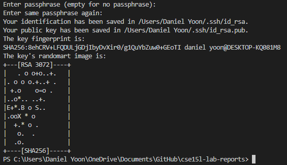

- The command has created a public and a private key in the directory `/Users/Daniel Yoon/.ssh/id_rsa`. 
    - The name of the private key will be `id_rsa` while the name of the public key will be `id_rsa.pub`.

        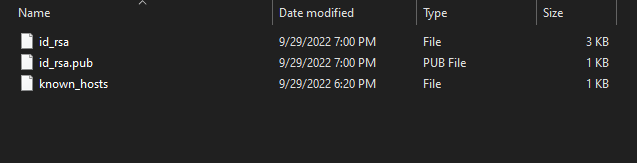

- Create a new directory in the remote machine named ".ssh" using the `mkdir .ssh` command. 
    - When you try to look for the file using `ls`, you will find nothing. However, the file is still there and can be visible using ls -lat. 

        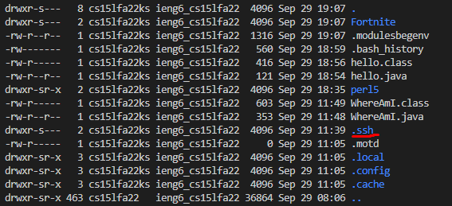

- Return to your local machine. 

- Secure copy `id_rsa.pub` using the command `scp *the directory in which id_rsa.pub is located* cs15lfa22**@ieng6.ucsd.edu:~/.ssh/authorized_keys`

    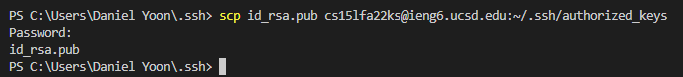

- After this is completed, you will be able to access the remote machine without being prompted for a password.

## Optimizing Remote Running
---
- Instead of having to log back into the remote machine, have two terminals open. One for the local machine, one for the remote machine. 

    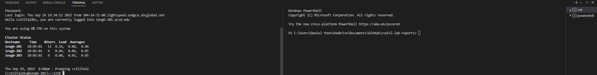

- You can directly send commands into remote server without having to login first. 
    - The command for this is `ssh cs15lfa22**@ieng6.ucsd.edu "<command you use to use>"`

        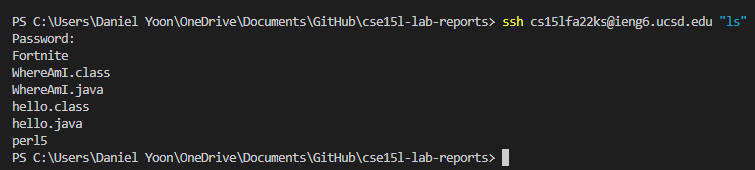
- In most terminals, you may even be able to run multiple commands on the same line, separating command with a semicolon. 
