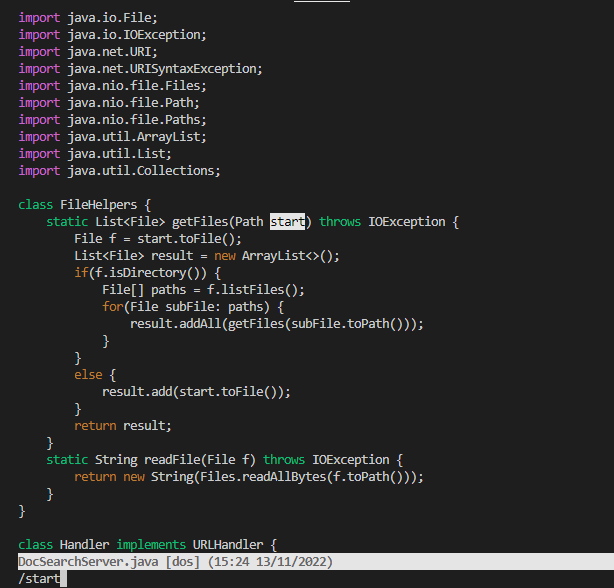
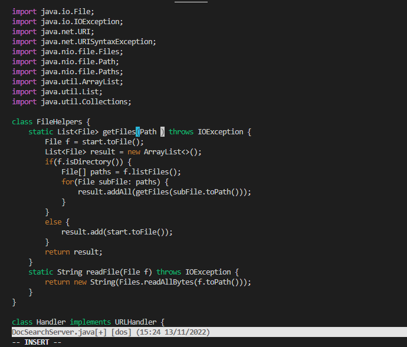
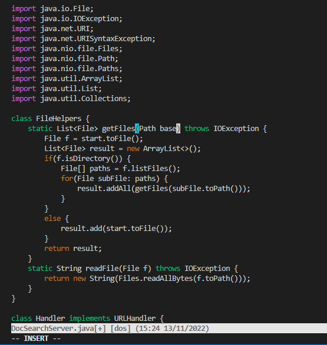
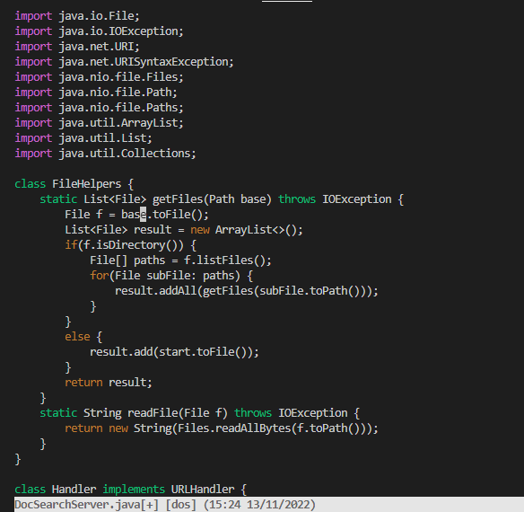
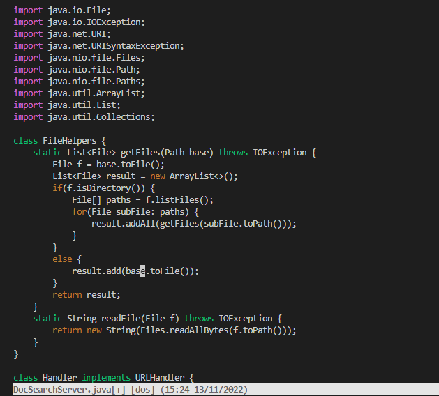

# Week 7 Lab Report

## Part 1: Week 6 Task 
- In DocSearchServer.java, change the name of the start parameter of getFiles, and all of its uses, to instead be called base.
- This task was accomplished in 15 key presses. 
- ```/start <enter>
    ‘c’
    ‘e’
    base
    <escape>
    ‘n’
    ‘.’
    ‘n’
    ‘.’
    :wq <enter>
    bash start.sh <value> <enter>
    ```
    - At step 1 I typed in /start in order to access the first instance of "start".

        

    - At step 2-3 I clear the entire word by performing 'c' and 'e'. 'c' allows me to replace, while 'e' allows me to replace to the end of the word, which goes up until the 't' in start. 

        
        
    - At step 4 I typed in base after performing 'e'. 

        

    - At step 6-7 I repeated the search and copied my last insert (from step 4)by performing 'n' and '.' respectively. 

        

    - At step 8-9 I repeated the search and copied my last insert (from step 4)by performing 'n' and '.' respectively. Here I performed the same step as I did on step 7.

        

## Part 2: SCP vs SSH-vim
- Making the edit in VSC and then uploading the file to the remote server using scp took 1 minute 15 seconds. 
    - The time to accomplish this task was faster given that I had an ssh key already logged into the remote machine. 
    - Because scp will not take in individual files, I had to upload the whole folder in which the directory was located. However, it still functioned. 
- Making the edit in vim while in the ssh took 49 seconds. 
    - Unfamiliarity with vim, with an unfamiliar interface made the tasks longer. If I had more experience with vim, then the task would have taken significantly less time. 
- I would prefer using the SSH-vim method. vim has enormous potential with the many commands at one's disposal. Although VSC has a superior user interface and is far more user-friendly, vim can accomplish simple tasks much more quickly should one grow accustomed to it. 
- However, if I had to edit multiple files, I would use VSC in order to streamline tasks. Because VSC is a development environment meant for coding, coding tasks are far superior on VSC than they are on vim, which acts as a general text file editor. 
