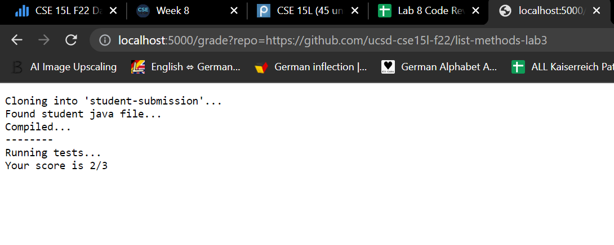
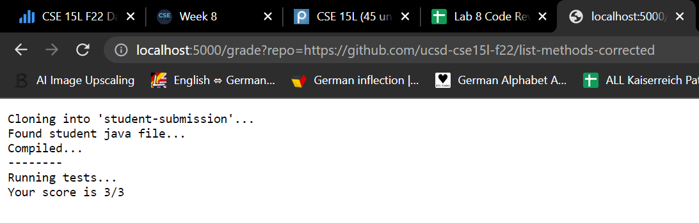
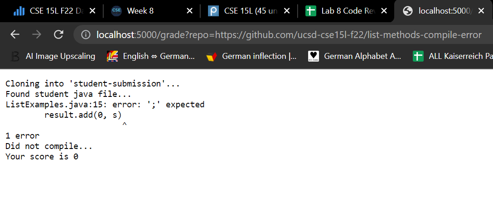

# Week 8 Lab Report

## Part 1: grading script

```
# remove student submission folder
rm -rf student-submission
 
# git clone the repo provided
git clone $1 student-submission
 
# check if file exists
if [ -f ./student-submission/ListExamples.java ]
then
   echo "Found student java file..."
else
   echo "No student java file..."
   exit 1
fi
 
#copy the needed files for testing
cp ./TestListExamples.java ./student-submission
cp -r ./lib ./student-submission
 
#go to dir
cd ./student-submission
 SCORE=0
javac -cp ".;lib/hamcrest-core-1.3.jar;lib/junit-4.13.2.jar" *.java
 
if [ $? -eq 0 ]
then
   echo "Compiled..."
else
   echo "Did not compile..."
   echo "Your score is" $SCORE
   exit 1
fi
echo "--------"
echo "Running tests..."

FAILED=$(java -cp ".;lib/junit-4.13.2.jar;lib/hamcrest-core-1.3.jar" org.junit.runner.JUnitCore TestListExamples | grep -oP "(?<=,  Failures: )[0-9]+")
 
if [[ $? -eq 1 ]]
then
  SCORE=$(($SCORE+2))
else
  SCORE=$(($SCORE+2-$FAILED))
fi
echo "Your score is" $SCORE"/3"
```

## Part 2: The Student Submissions, graded

- Student Submission 1: list-methods-lab3 

    

- Student Submission 2: list-methods-corrected 

    

- Student Submission 3: list-methods-compile-error

    

## Part 3: Tracing the Student Submission: list-methods-corrected

- `rm -rf student-submission`
    - `stdout`: None
    - `stderr`: None
    - Return code: zero

- `git clone $1 student-submission`
    - `stdout`: "Cloning into 'student-submission'..."
    - `stderr`: None
    - Return code: zero

- `if [ -f ./student-submission/ListExamples.java ]`
    - Is **true** because the -f command has found the specified file ListExamples.java in directory student-submission.
    - `echo "Found student java file..."`
        - `stdout`: "Found student java file..."
        - `stderr`: None
        - Return code: zero
    - `echo "No student java file..."` /
      `exit 1`
      - Does not run. 


- `cp ./TestListExamples.java ./student-submission`
    - `stdout`: None
    - `stderr`: None
    - Return code: zero

- `cp -r ./lib ./student-submission`
    - `stdout`: None
    - `stderr`: None
    - Return code: zero
    
- `cd ./student-submission`
    - `stdout`: None
    - `stderr`: None
    - Return code: zero

- `javac -cp ".;lib/hamcrest-core-1.3.jar;lib/junit-4.13.2.jar" *.java`
    - `stdout`: None
    - `stderr`: None
    - Return code: zero

- `if [ $? -eq 0 ]`
    - Is **true** because the return code of the previous command was zero, as the java files were compiled successfully. 
    - `echo "Compiled..."`
      - `stdout`: "Compiled..."
      - `stderr`: None
      - Return code: zero
    - `echo "Did not compile..."` /
      `echo "Your score is" $SCORE` /
      `exit 1`
        - Does not run. 

- `echo "--------"`
    - `stdout`: "--------"
    - `stderr`: None
    - Return code: zero
  
- `echo "Running tests..."`
    - `stdout`: "Running tests..."
    - `stderr`: None
    - Return code: zero 
  
- `java -cp ".;lib/junit-4.13.2.jar;lib/hamcrest-core-1.3.jar" org.junit.runner.JUnitCore TestListExamples | grep -oP "(?<=,  Failures: )[0-9]+"`
    - `stdout`: None
    - `stderr`: None
    - Return code: zero

- `if [[ $? -eq 1 ]]`
    - Is **false** because the return code of the previous command was zero, not nonzero 1. 
    - `SCORE=$(($SCORE+2-$FAILED))`
      - `stdout`: None
      - `stderr`: None
      - Return code: zero
    - `SCORE=$(($SCORE+2-$FAILED))`
      - Does not run.

- `echo "Your score is" $SCORE"/3"`
    - `stdout`: "Your score is 3/3" 
    - `stderr`: None
    - Return code: zero   